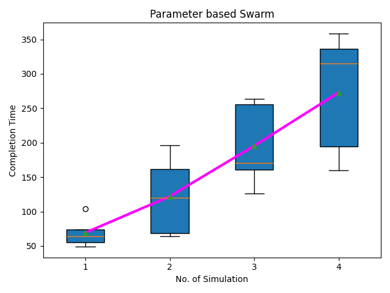
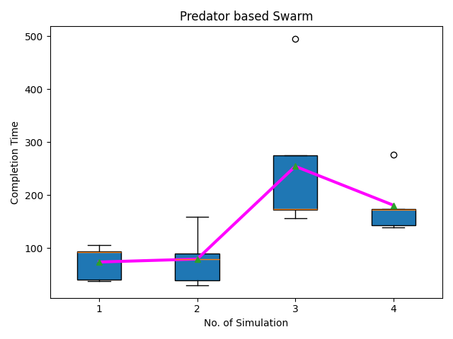

# **BIOMIMETICS in Bio-Inspired Robot Teams (BIRT)**

This repository contains the implementation of the **BIOMIMETICS** section from the research paper titled *"Toward Human Interaction with Bio-Inspired Teams"*, presented at the 10th International Conference on Autonomous Agents and Multiagent Systems (AAMAS 2011). The focus of this implementation is on exploring human interaction with bio-inspired robot teams (BIRT) in a foraging task using biomimetic models.

## Overview

In the context of bio-inspired teams, biomimetics refers to modeling agents' behaviors based on biological principles observed in nature, such as the behavior of fish schools. This implementation simulates two biomimetic management strategies for a foraging task:

- **Parameter-Based Management (PAR)**
- **Predator-Based Management (PRED)**

The implementation aims to understand how these models perform in terms of task completion time and resource consumption under varying conditions.

## Models Implemented

### 1. Parameter-Based Management (PAR)
- Fish behavior is controlled by parameters that determine how they spread out and maintain distances from each other.
- Fish autonomously spread out across the environment to forage for food, with parameters optimized for efficiency.

### 2. Predator-Based Management (PRED)
- An operator controls a predator that influences the movement of fish, causing them to cluster and respond to the predator's presence.
- This model simulates how fish in a school react to external threats while foraging.

## Simulations
The implementation includes several simulations to compare the performance of PAR and PRED under different conditions:
- **Food Unit:** Food container contains different number of food units in each simulation.
- **Food Placement:** Food containers are randomly distributed across the environment, requiring coordinated fish behavior.

Each simulation consists of 5 trials and computes the interquartile range of the completion time to complete the consumption of the food items. Results from the simulations provide insights into the efficiency and robustness of each model.

## Usage
Run the simulations using the following command:

```bash
python3 hubirt_main.py
```

If you need to change the parameter, you can change it from main python file where parameters are set.

## Results
Simulation results, including completion times and resource consumption, are stored in the *'results/'* directory. The results are presented with statistical analyses such as mean, interquartile range, and trends.

The following figure shows the interquartile range and trends obtained during the simulation time:

<div>
  <figure style="display: inline-block; margin-right: 40px;">
    
    <figcaption>Figure 1: Parameter based Management</figcaption>
    
    <figcaption>Figure 2: Predator based Management</figcaption>
  </figure>
</div>

<div align="center">
  <figure style="display: inline-block; margin: 0 20px;">
    
    <figcaption style="text-align:center;">Figure 1: Cumulative Rewards</figcaption>
  </figure>
  <figure style="display: inline-block; margin: 0 20px;">
    
    <figcaption style="text-align:center;">Figure 2: Episode Length</figcaption>
  </figure>
</div>

In figure 1, the box plot shows the completion times of a parameter-based swarm algorithm across four simulations. Simulation 1 was the fastest, while Simulation 4 was the slowest. The interquartile range varies, indicating different levels of variability due to the stochasticity of the simulation. Outliers are present in Simulations 1 and 4. The plot suggests a general trend of increasing completion time with increasing food container as well as food unit. Figure 2 illustrates the completion time of a predator-based swarm algorithm across four simulations. Simulation 3 had the highest median completion time, while Simulation 2 had the lowest. The interquartile range varies, indicating different levels of variability. Outliers are present in Simulations 1 and 3. The plot suggests a general trend of increasing and then decreasing completion time with increasing food container as well as food unit.


## Acknowledgements
This work is based on the research conducted by Michael A. Goodrich, P. B. Sujit, Brian Pendleton, Jose Pinto, and Jacob W. Crandall, and was funded by ONR and ARL.

### References
Goodrich, M.A., Pendleton, B., Sujit, P.B., Pinto, J. and Crandall, J.W., 2011, May. Toward human interaction with bio-inspired teams. In The 10th International Conference on Autonomous Agents and Multiagent Systems-Volume 3 (pp. 1265-1266).
